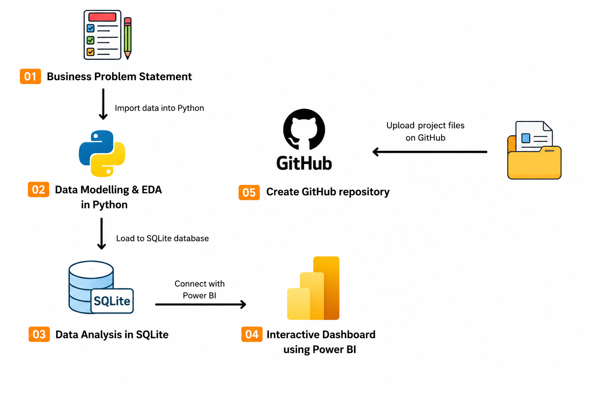

# Customer Shopping Behavior Analysis using Python, SQLite & Power BI

## 📌 Project Overview

This project demonstrates a complete end-to-end data analytics workflow using Python, SQLite, and Power BI. The objective is to transform raw customer shopping data into actionable business insights through data cleaning, exploratory analysis, SQL querying, and interactive dashboard development.

The project simulates a real-world business scenario where customer shopping behavior data is analyzed to uncover purchasing patterns, customer preferences, revenue trends, and key business opportunities.

---

## 🔄 Project Workflow

<p align="center">
  
</p>

The project follows a complete analytics pipeline:

1. Define the business problem and objectives.
2. Import and explore raw customer shopping data.
3. Perform data cleaning, transformation, and exploratory data analysis using Python in Google Colab.
4. Load the cleaned dataset into SQLite and perform SQL-based business analysis.
5. Build an interactive Power BI dashboard to visualize insights.
6. Publish the project and findings on GitHub.

---

## 🎯 Business Problem

Retail businesses generate large volumes of customer transaction data every day. However, raw data alone cannot help organizations make informed decisions.

The objective of this project is to analyze customer shopping behavior and answer key business questions such as:

* Which customer segments generate the highest revenue?
* What purchasing patterns exist across different age groups?
* Which product categories contribute the most to sales?
* How do demographics influence customer spending behavior?
* What actionable insights can improve business performance?

---

## 🛠️ Tools & Technologies Used

### Programming & Analysis

* Python
* Google Colab
* Pandas


### Data Visualization

* Power BI

### Database & Querying

* SQLite3
* SQL

### Version Control

* Git
* GitHub

---

## 🧹 Data Cleaning & Preparation

The dataset underwent multiple preprocessing steps before analysis:

* Handling missing values
* Removing duplicate records
* Standardizing column formats
* Converting data types
* Creating derived features for analysis
* Validating data quality

These steps ensured the dataset was clean, consistent, and ready for business analysis.

---

## 📊 Exploratory Data Analysis (EDA)

Exploratory Data Analysis was performed using Python to understand customer behavior patterns and identify trends within the dataset.

Key areas explored include:

* Customer demographics
* Spending distribution
* Purchase frequency
* Product category preferences
* Revenue contribution by customer segment
* Behavioral trends across age groups and genders

Visualizations were created to identify relationships and uncover meaningful patterns before moving to SQL analysis.

---

## 🗄️ SQL Analysis using SQLite3

After cleaning the dataset, it was loaded into a SQLite database within Google Colab for business analysis.

SQL queries were used to answer important business questions and generate insights.

### Example Business Questions

* Which age group contributes the highest revenue?
* Which product categories generate the most sales?
* What are the top-performing customer segments?
* Which demographic groups spend the most?
* How are purchases distributed across categories?

### Sample Query

```sql
SELECT
    age_group,
    SUM(purchase_amount) AS total_revenue
FROM sales_data
GROUP BY age_group
ORDER BY total_revenue DESC;
```

---

## 📈 Power BI Dashboard

An interactive dashboard was developed in Power BI to visualize key metrics and business insights.

### Dashboard Features

* Revenue Overview
* Customer Demographics Analysis
* Product Category Performance
* Customer Spending Trends
* Purchase Behavior Analysis
* Interactive Filters & Slicers

The dashboard enables users to explore the data dynamically and gain actionable insights through intuitive visualizations.

---

## 📷 Dashboard Preview

### Executive Dashboard


### Customer Analysis


### Product Analysis


---

## 🔍 Key Insights

Some of the insights generated through this analysis include:

* Identification of high-value customer segments.
* Revenue contribution across different age groups.
* Top-performing product categories.
* Customer purchasing preferences and trends.
* Demographic factors influencing spending behavior.

---

## 💼 Skills Demonstrated

This project demonstrates practical experience in:

* Data Cleaning & Preprocessing
* Exploratory Data Analysis (EDA)
* SQL Querying & Business Analysis
* Database Management using SQLite
* Data Visualization
* Dashboard Development
* Business Intelligence
* Data Storytelling
* Insight Generation

---

## 🚀 How to Run the Project

### 1. Clone the Repository

```bash
git clone https://github.com/your-username/customer-shopping-behavior-analysis.git
```

### 2. Open the Google Colab Notebook

Run the notebook to:

* Import data
* Perform data cleaning
* Conduct exploratory analysis
* Load data into SQLite
* Execute SQL queries

### 3. Open Power BI Dashboard

Open the `.pbix` file in Power BI Desktop to explore the interactive dashboard.

---

## 🎓 Learning Outcomes

Through this project, I gained hands-on experience in:

* Building an end-to-end analytics workflow
* Working with real-world customer data
* Performing SQL analysis using SQLite3
* Creating professional Power BI dashboards
* Transforming raw data into actionable business insights
* Communicating findings through data storytelling

---

## 👨‍💻 Author

**Abhay Negi**

Aspiring Data Analyst with a passion for data analytics, business intelligence, and transforming complex datasets into meaningful insights.

If you found this project helpful, feel free to ⭐ star the repository and connect with me on LinkedIn.
